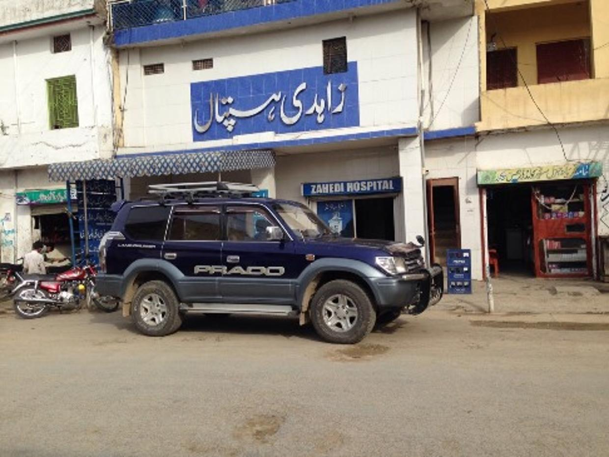
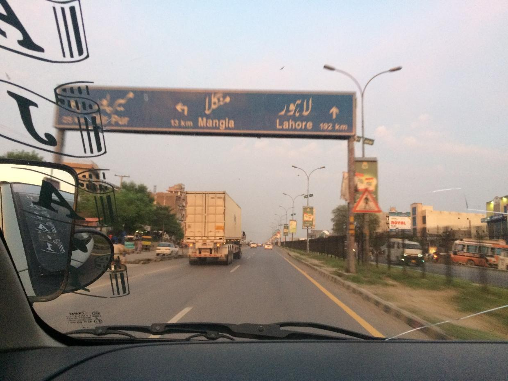
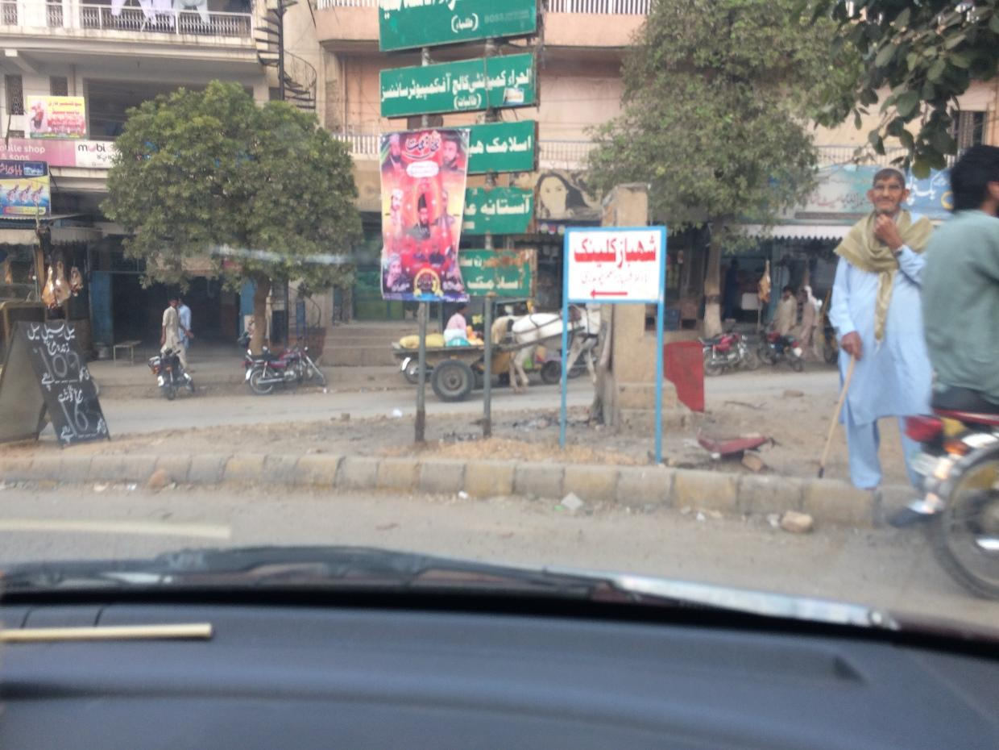
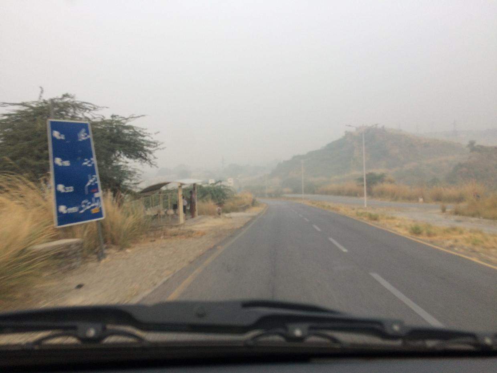
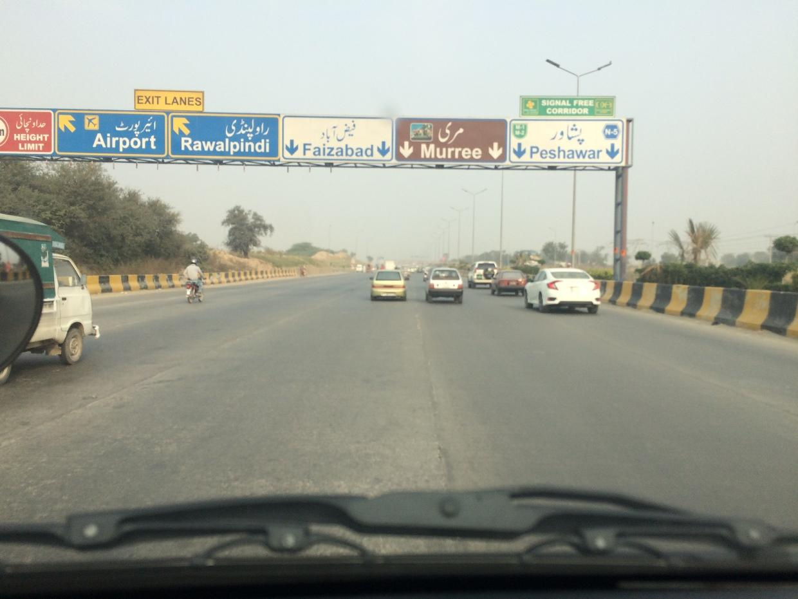

# UrText    (Urdu Dataset comprised of outdoor images)

# OutDoorUrduDataset
<b>Snapped ->> Urdu Dataset for Outdoor Text Detection and Recognition</b>

  
 
   
 

  

Initially in our research-paper-experiments, a new Urdu text detection dataset " UrText ", consisting of 2K+ snapped images are developed
. 
. 

## Snapped Outdoor Urdu Dataset
--->>> The <b>UrText dataset</b> consisting of more than 2070 images (also corresponding 2070 annotations)  is <b>most similar to the dataset</b> we used in our exmperiments/research with minor differences. Images are given in zipped format and the <b>annotation </b> can be obtained after 30March2021, by <b>emailing the address below</b>. 
. 
. 
 
! 
! 
! 
! 
! 
Please cite our dataset as!!
 
<b>
Syed Yasser Arafat, and Muhmmad Javed Iqbal. "Urdu-Text Detection and Recognition in Natural Scene Images Using Deep Learning." IEEE Access (2020).
</b>
 
 
 
 

  
 for any queries: <b > [Syed Yasser Arafat]: <mailto:syed.yasser.arafat@gmail.com> </b> 

syed.yasser.arafat@gmail.com
